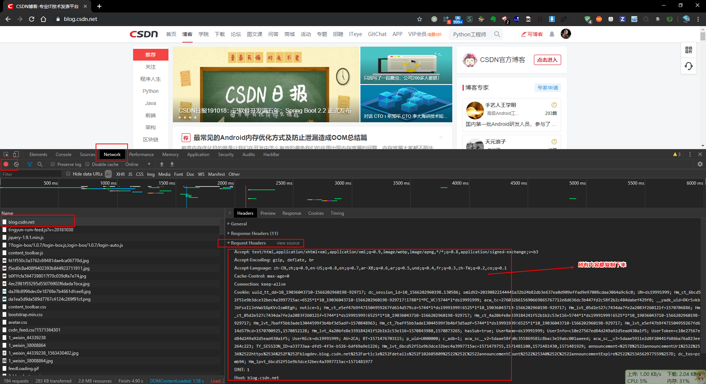

# CSDN 爬虫

> 主要功能：爬取 csdn 博客指定用户的所有博文并转换为 markdown 格式保存到本地。

## 下载脚本
```shell
git clone https://github.com/ds19991999/csdn-spider.git
cd csdn-spider
python3 -m pip install -r requirements.txt

# 测试
python3 test.py # 需要先配置登录 cookie
```

## 获取 cookie

登录 `csdn` 账号，进入：https://blog.csdn.net ，按 `F12` 调试网页，复制所有的 `Request Headers`，保存到`cookie.txt`文件中




## 爬取用户全部博文
```python
import csdn
csdn.spider(["ds19991999", "u013088062"], "cookie.txt",5)
# 参数 usernames: list, cookie_path:str, thread_num: int = 10, folder_name: str = "articles"
```

## LICENSE

<a rel="license" href="http://creativecommons.org/licenses/by-nc-sa/4.0/"></a>


`PS`：随意写的爬虫脚本，佛系更新。