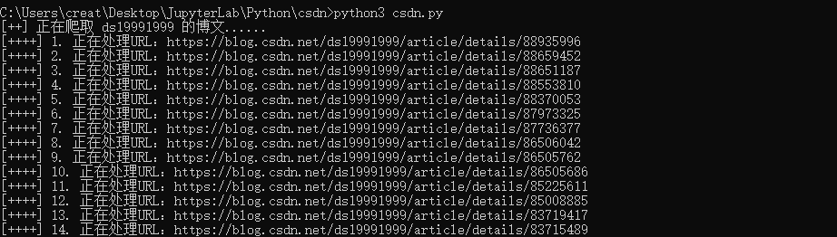
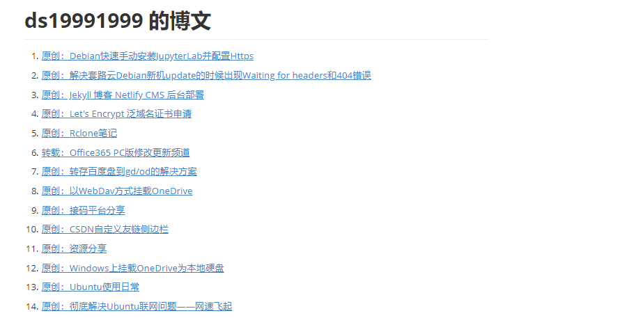
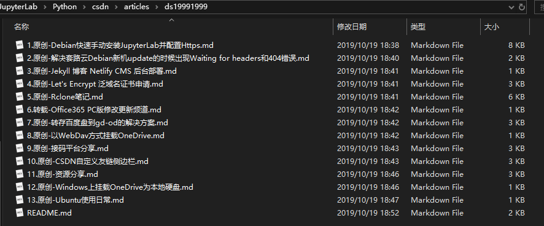
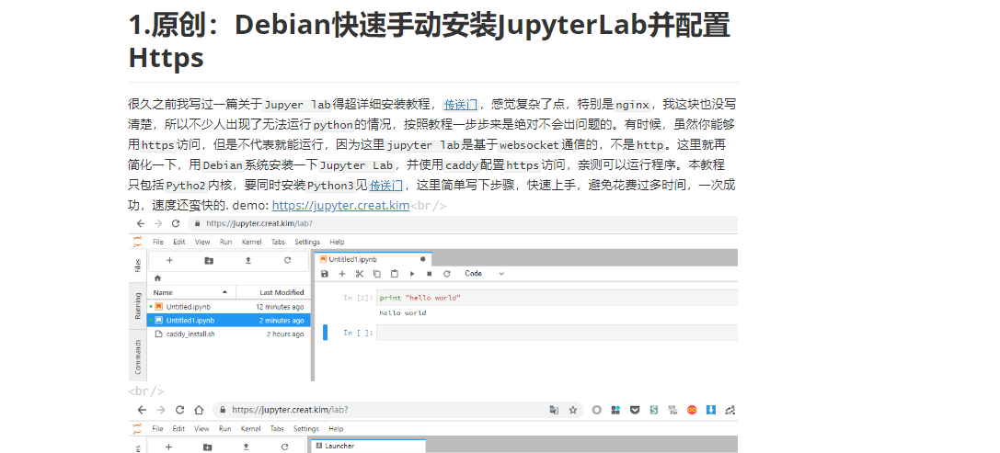

# CSDN 爬虫脚本

主要功能：爬取 `csdn` 博客指定用户的所有博文并转换为 `markdown` 格式保存到本地。

## 一、运行环境

需要安装`WebDriver`驱动，https://chromedriver.chromium.org/downloads，下载与本地对应的`chrome`驱动后，将其添加至环境变量`$PATH`

```shell
python3
python3 -m pip install -r requirements.txt
```

## 二、获取脚本

```shell
git clone https://github.com/ds19991999/csdn-spider.git
```

## 三、用法

### 1.获取cookie

登录 `csdn` 账号，进入：https://blog.csdn.net ，按 `F12` 调试网页，复制所有的 `Request Headers`，保存到`cookie.txt`文件中


### 2.添加需要爬取的 `csdn` 用户

在`username.txt`中添加用户名，一行一个

### 3.运行脚本

```shell
python3 csdn.py
```

## 四、效果

**运行过程**



**文章列表建立**：`./articles/username/README.md`



**爬取的博文**：`./articles/username/`



**博文转换效果**：



## 五、LICENSE

<a rel="license" href="http://creativecommons.org/licenses/by-nc-sa/4.0/"></a>


`PS`：随意写的爬虫脚本，佛系更新。